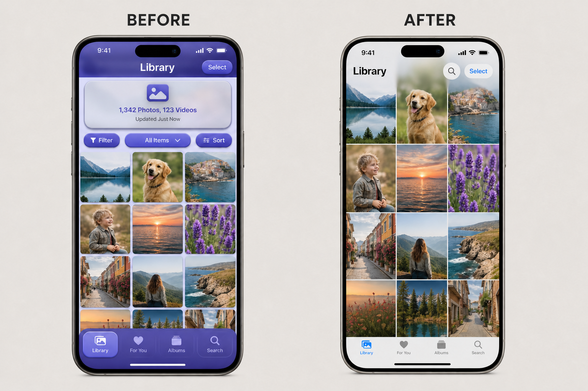

# iOS 26 Component Modernizer

把现有 SwiftUI / UIKit 组件转换为更原生、更可靠的 iOS 26+ 实现，而不是简单地给所有界面加一层玻璃。

Modernize existing SwiftUI and UIKit components for iOS and iPadOS 26+ with system structures, native controls, and purposeful Liquid Glass.

> Independent open-source project. Not affiliated with or endorsed by Apple Inc. or OpenAI.

## 简介 / Overview / 概要 / 개요 / Resumen

- **简体中文：** 审计并升级现有 SwiftUI/UIKit 组件，优先使用 iOS 26+ 原生结构和控件，只在合适的功能层采用 Liquid Glass，同时保留旧系统回退。
- **English:** Audit and modernize existing SwiftUI/UIKit components with iOS 26+ system structures and controls, using Liquid Glass only where it belongs and preserving earlier-OS fallbacks.
- **日本語：** 既存の SwiftUI/UIKit コンポーネントを監査し、iOS 26+ の標準構造とコントロールへ移行します。Liquid Glass は適切な操作レイヤーだけに使い、旧 OS 向けフォールバックも維持します。
- **한국어:** 기존 SwiftUI/UIKit 컴포넌트를 점검하고 iOS 26+ 시스템 구조와 네이티브 컨트롤로 현대화합니다. Liquid Glass는 적절한 기능 계층에만 적용하며 이전 OS의 대체 동작을 유지합니다.
- **Español:** Audita y moderniza componentes SwiftUI/UIKit con estructuras y controles nativos de iOS 26+, usando Liquid Glass solo cuando corresponde y conservando alternativas para versiones anteriores.

## 它能做什么

- 审计已有 SwiftUI/UIKit 代码，找出旧式导航栏、工具栏、Tab Bar、自定义模糊和外观覆盖。
- 判断组件应该保持不变、移除干扰样式、替换为系统组件，还是使用自定义 Liquid Glass。
- 实现 iOS 26+ 原生按钮、工具栏、Tab、搜索、Sheet 和自定义玻璃控件。
- 在最低系统低于 iOS 26 时保留行为一致的回退实现。
- 构建并检查无障碍、深浅色、动态字体、不同设备和性能风险。

它不会把普通内容卡片全部玻璃化，也不会为了使用新 API 擅自提高你的最低系统版本。

## Before / After

The comparison below shows the intended difference: remove a hand-built blur-and-shadow control cluster, then let native structure, system controls, hierarchy, and content do the work.



This is a conceptual comparison created for the project, not an Apple screenshot. Actual migrations depend on the app's behavior, content, deployment target, and accessibility requirements.

## 安装

```bash
mkdir -p ~/.codex/skills
git clone https://github.com/yhstef/ios-26-component-modernizer.git \
  ~/.codex/skills/ios-26-component-modernizer
```

如果 Codex 没有立即显示该技能，请重启 Codex。

## 使用

显式调用：

```text
$ios-26-component-modernizer 审计这个 SwiftUI 项目，把适合的组件升级为 iOS 26+ 原生实现，保留 iOS 18 回退并完成构建验证。
```

```text
$ios-26-component-modernizer Review this UIKit screen, remove legacy bar styling, and modernize its controls for iOS 26+ without changing behavior.
```

也可以直接描述“升级 iOS 26 组件”“迁移 Liquid Glass”“替换自定义工具栏”等任务，让 Codex 自动选择该技能。

## 工作方式

1. 检查项目结构、SDK、最低系统版本和现有组件。
2. 用最新 SDK 重编译，观察系统组件已经自动获得的变化。
3. 为每个组件选择：保留、移除干扰、替换为系统组件、使用自定义玻璃或保持为内容层。
4. 实现最小且完整的一组修改。
5. 在 iOS 26+ 与旧系统回退路径上验证行为、无障碍和布局。

可选的只读审计：

```bash
python3 scripts/audit_components.py /path/to/YourApp
python3 scripts/audit_components.py /path/to/YourApp --json
```

扫描结果只是需要人工判断的候选项，不代表错误。

## Requirements

- Codex with local skills support.
- Xcode 26 or newer to compile the iOS 26 APIs used by a migration.
- A real SwiftUI or UIKit project for implementation and build verification.
- Earlier deployment targets remain supported when the project requires them; the skill uses availability-gated fallbacks.

## Design principles

- Recompile before rewriting.
- Prefer standard components before custom glass.
- Keep Liquid Glass in the functional layer for controls and navigation.
- Remove legacy backgrounds that interfere with system bars and scroll-edge effects.
- Preserve behavior, accessibility, performance, and user-owned project conventions.
- Never claim a build or runtime check passed unless it actually ran.

The guidance is grounded in Apple’s [Adopting Liquid Glass](https://developer.apple.com/documentation/technologyoverviews/adopting-liquid-glass), [Materials HIG](https://developer.apple.com/design/human-interface-guidelines/materials), [SwiftUI migration session](https://developer.apple.com/videos/play/wwdc2025/323/), and [UIKit migration session](https://developer.apple.com/videos/play/wwdc2025/284/).

## Repository contents

- `SKILL.md` — routing, migration workflow, safety rules, and verification contract.
- `references/apple-guidance.md` — maintained Apple-source baseline.
- `references/swiftui-modernization.md` — SwiftUI conversion patterns.
- `references/uikit-modernization.md` — UIKit conversion patterns.
- `scripts/audit_components.py` — zero-dependency, read-only migration candidate scanner.

## License

MIT. See [LICENSE](LICENSE).
